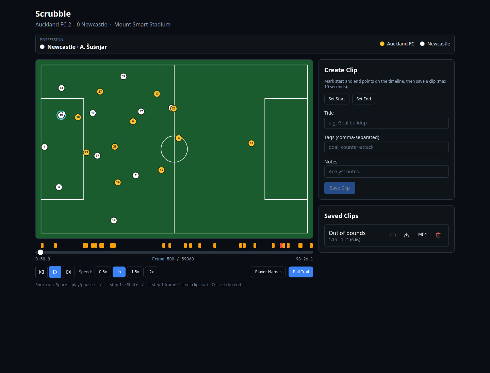

# Scrubble



Live demo: https://scrubble-igzb.onrender.com

Top 3, US Soccer × ColorStack Tech League Hackathon.

A web app for scrubbing through SkillCorner open tracking data like a YouTube video, and clipping 0–10 second sequences to share with teammates.

## Demo Match

Default match: **Auckland FC 2 – 0 Newcastle** (ID `1886347`, A-League, Nov 2024).

## Tech Stack

| Layer | Technology |
|-------|-----------|
| Backend | Python, FastAPI, pandas, numpy |
| Frontend | Vite, React, TypeScript, Tailwind CSS, shadcn/ui |
| Storage | SQLite (clips), JSONL + byte-offset index (frames) |
| Export | Pillow, imageio + ffmpeg (GIF/MP4) |
| Deploy | Docker on Render |

## Quick Start

### 1. Prepare match data

```bash
cd backend
pip install -r requirements.txt
python prepare_match.py 1886347
```

This downloads tracking JSONL (~90 MB), dynamic events, and match metadata from [SkillCorner opendata](https://github.com/SkillCorner/opendata). Data is saved to `data/` (gitignored).

### 2. Run locally

```bash
# Terminal 1 — backend (port 8765)
cd backend && uvicorn main:app --reload --port 8765

# Terminal 2 — frontend (port 4321)
cd frontend && npm install && npm run dev
```

Open http://localhost:4321

### 3. Docker

The root `Dockerfile` builds the Vite app, runs `prepare_match.py 1886347`, and serves the site and the API from FastAPI on one port. `render.yaml` is the Render blueprint for that image.

```bash
docker build -t scrubble .
docker run -p 10000:10000 scrubble
```

`docker-compose.yml` still runs the Vite dev server and the API as two processes, for local development. Prepare the match first:

```bash
python backend/prepare_match.py 1886347
docker compose up --build
```

## Features

- **YouTube-style scrubber** — drag the timeline to any moment in the match
- **Smooth playback** — requestAnimationFrame loop with frame interpolation
- **Clip & share** — mark 0–10 second ranges, add title/tags/notes, copy shareable links
- **Export** — download clips as GIF or MP4
- **Key moments** — goal and shot markers from dynamic events on the timeline
- **Analyst extras** — player names/numbers, ball trail, keyboard shortcuts

## Architecture

```
┌─────────────┐     REST API      ┌──────────────┐
│  React UI   │ ◄──────────────► │   FastAPI    │
│  (Canvas)   │   /api/frames    │  FrameReader │
│  Scrubber   │   /api/clips     │  SQLite DB   │
└─────────────┘                   └──────┬───────┘
                                         │
                                  ┌──────▼───────┐
                                  │ data/matches │
                                  │  JSONL index │
                                  │  meta.json   │
                                  └──────────────┘
```

### Data flow

1. `prepare_match.py` downloads raw SkillCorner files and builds a byte-offset index for O(1) frame seeking
2. Frontend requests frames via `/api/frames/{n}` or batch endpoint
3. Canvas renders pitch + players + ball; interpolation blends between frames for smooth motion
4. Clips saved to SQLite; exports rendered server-side with Pillow

## Technical Choices

- **Byte-offset frame index** — avoids loading 90 MB JSONL into memory; seeks directly to any frame
- **Line-by-line JSONL streaming** — `prepare_match.py` reads tracking file once to build the index
- **Canvas over SVG/D3** — simpler for a student to explain; performant at 60 fps with interpolation
- **SQLite for clips** — zero-config persistence, easy to inspect
- **Separate prepare script** — judges can swap any match ID without touching app code

## Code Tour

### Backend

| File | Purpose |
|------|---------|
| `prepare_match.py` | CLI: download match files, build frame index, extract metadata & key moments |
| `main.py` | FastAPI routes: health, meta, frames, clips CRUD, GIF/MP4 export |
| `frame_reader.py` | Seeks into JSONL using byte offsets, returns single or batch frames |
| `db.py` | SQLite schema and CRUD for clips |
| `events.py` | Parses dynamic events CSV for goals and shots |
| `export.py` | Renders frames to images, exports GIF/MP4 via imageio |

### Frontend

| File | Purpose |
|------|---------|
| `App.tsx` | Main state: playback loop, keyboard shortcuts, clip deep-links |
| `api.ts` | Fetch wrappers for all backend endpoints |
| `types.ts` | TypeScript interfaces for match, frames, clips |
| `lib/interpolate.ts` | Blends two tracking frames for smooth sub-frame playback |
| `components/PitchCanvas.tsx` | Draws pitch, players, ball, and trail on HTML canvas |
| `components/Scrubber.tsx` | Timeline slider with clip regions and key-moment markers |
| `components/PlaybackControls.tsx` | Play/pause, speed, step, toggle names/trail |
| `components/ClipPanel.tsx` | Create, list, share, export, and delete clips |

## Keyboard Shortcuts

| Key | Action |
|-----|--------|
| Space | Play / Pause |
| ← / → | Step 1 second |
| Shift + ← / → | Step 1 frame |
| I | Set clip start |
| O | Set clip end |

## Swapping Matches

```bash
python backend/prepare_match.py <match_id>
# Set MATCH_ID env var or edit docker-compose.yml
```

Any match from [SkillCorner opendata](https://github.com/SkillCorner/opendata) works.
